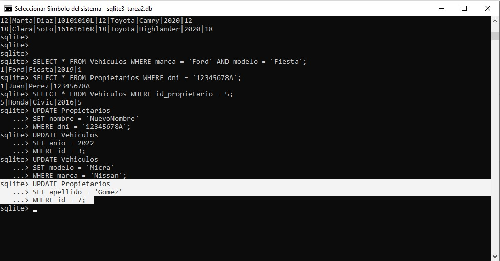

## Paso 1: Crear una tabla con un campo de cada tipo

1) Utilizando la terminal o línea de comandos, abre SQLite3 y crea una base de datos llamada tarea2.db.

DESDE CMD HE ABIERTO SQLITE3 Y HE EJECUTADO .OPEN TAREA2.DB, PARA CREAR UNA NUEVA BASE DE DATOS

-----------------------------------------------------------------------------------

2) Dentro de SQLite3, crea las siguientes tablas.

TENIENDO SELECCIONADA LA BASE DE DATOS TAREA2.DB, HE UTILIZADO EL OPERADOR __CREATE__ PARA LA CREACION DE LAS TABLAS CON LOS PARAMETROS INDICADOS.

-----------------------------------------------------------------------------------

## Paso 2: Insertar 20 entradas

1) Dado el siguiente conjunto de información:

| id_propietario | nombre      | apellido    | dni       | marca      | modelo     | ano  |
|----------------|-------------|-------------|-----------|------------|------------|------|
| 1              | Juan        | Perez       | 12345678A | Ford       | Fiesta     | 2019 |
| 2              | Maria       | Lopez       | 87654321B | Toyota     | Corolla    | 2018 |
| 3              | Carlos      | Ruiz        | 11111111C | Nissan     | Sentra     | 2020 |
| 4              | Laura       | Gomez       | 22222222D | Chevrolet  | Spark      | 2017 |
| 5              | Pedro       | Martinez    | 33333333E | Honda      | Civic      | 2016 |
| 6              | Ana         | Fernandez   | 44444444F | Ford       | Mustang    | 2021 |
| 7              | Diego       | Sanchez     | 55555555G | Toyota     | RAV4       | 2019 |
| 8              | Sofia       | Torres      | 66666666H | Volkswagen | Golf       | 2020 |
| 9              | Javier      | Leon        | 77777777I | Honda      | CR-V       | 2018 |
| 10             | Lucia       | Castillo    | 88888888J | Nissan     | Altima     | 2017 |
| 11             | Luis        | Gonzalez    | 99999999K | Chevrolet  | Malibu     | 2019 |
| 12             | Marta       | Diaz        | 10101010L | Toyota     | Camry      | 2020 |
| 13             | Victor      | Vargas      | 11111112M | Honda      | Accord     | 2018 |
| 14             | Elena       | Castro      | 12121212N | Ford       | Explorer   | 2021 |
| 15             | Roberto     | Blanco      | 13131313O | Nissan     | Rogue      | 2017 |
| 16             | Natalia     | Paredes     | 14141414P | Volkswagen | Jetta      | 2019 |
| 17             | Fernando    | Herrera     | 15151515Q | Chevrolet  | Equinox    | 2018 |
| 18             | Clara       | Soto        | 16161616R | Toyota     | Highlander | 2020 |
| 19             | Sergio      | Mendoza     | 17171717S | Honda      | Odyssey    | 2016 |
| 20             | Patricia    | Navarro     | 18181818T | Nissan     | Murano     | 2019 |

Realiza la inserción en la tablas de modo que la información quede almacenada.

EN ESTA SITUACION UTILIZO EL OPERADOR INSERT, SELECCIONO LA TABLA CORRESPONDIENTE Y PROCEDO A INSERTAR LOS DATOS.

-----------------------------------------------------------------------------------

## Paso 3: Realizar las siguientes 10 consultas de datos

1) Seleccionar todos los propietarios

-----------------------------------------------------------------------------------

2) Listar todos los vehículos.

-----------------------------------------------------------------------------------

3) Seleccionar solo los nombres y apellidos de los propietarios.

-----------------------------------------------------------------------------------

4) Listar todas las marcas y modelos de los vehículos.

-----------------------------------------------------------------------------------

5) Seleccionar solo los propietarios con apellido "Perez".

-----------------------------------------------------------------------------------

6) Listar todos los vehículos con año 2019.

-----------------------------------------------------------------------------------

7) Seleccionar propietarios que tienen vehículos de la marca "Toyota".

EN ESTE CASO UTILIZO __JOIN__ PARA VINCULAR LA TABLA PROPIETARIOS CON LA TABLA VEHICULOS, Y UTILIZO __ON__ PARA ESTABLECER LAS CONDICIONES DE ESE VINCULO

-----------------------------------------------------------------------------------

8) Listar vehículos con marca "Ford" y modelo "Fiesta".

ACA UTILIZO EL OPERADOR __AND__ PARA AGREGAR UN SEGUNDO CONDICIONAL.

-----------------------------------------------------------------------------------

9) Seleccionar propietarios con DNI "12345678A".

-----------------------------------------------------------------------------------

10) Listar vehículos que pertenecen al propietario con ID 5.

-----------------------------------------------------------------------------------

## Paso 4: Realiza los siguientes updates

1) Actualizar el nombre de un propietario con DNI "12345678A".

-----------------------------------------------------------------------------------

2) Modificar el año de un vehículo con ID 3 a 2022.

-----------------------------------------------------------------------------------

3) Cambiar el modelo de todos los vehículos Nissan a "Micra".

-----------------------------------------------------------------------------------

4) Actualizar el apellido de un propietario con ID 7 a "Gomez".

-----------------------------------------------------------------------------------

5) Modificar la marca de un vehículo con modelo "Fiesta" a "Renault".

## UNA VERIFICACION DE LOS CAMBIOS

