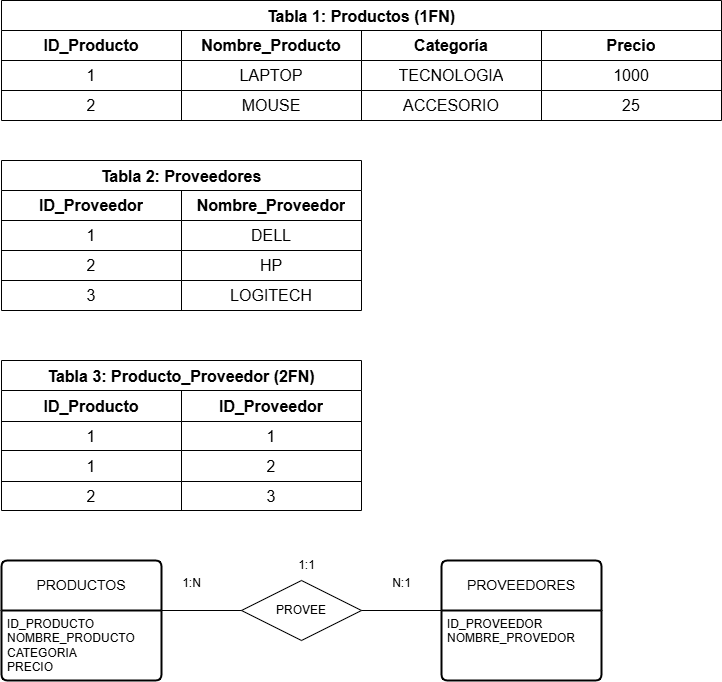
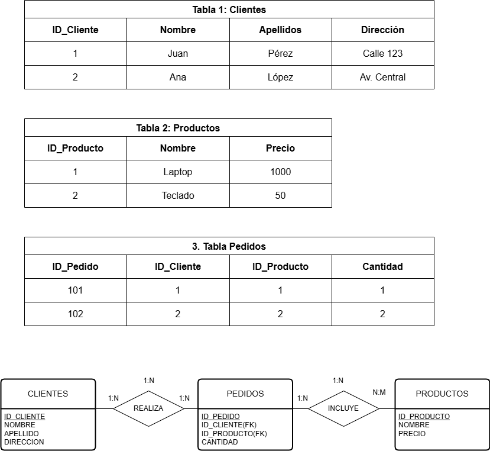
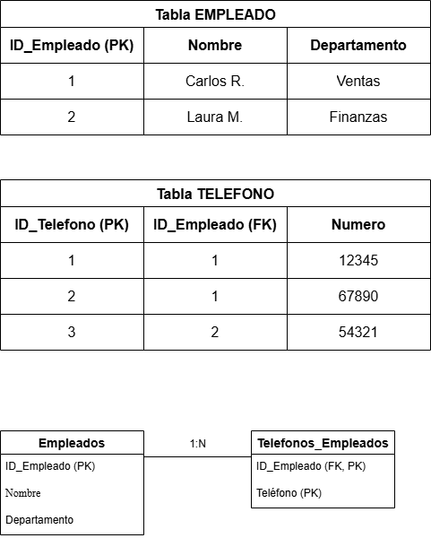
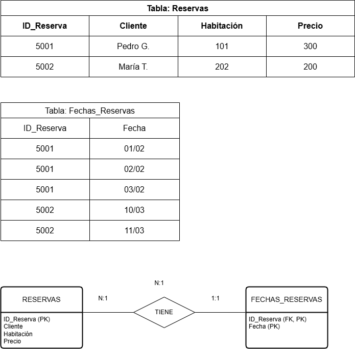
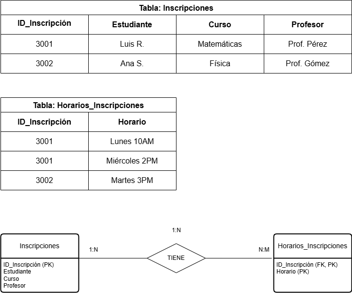
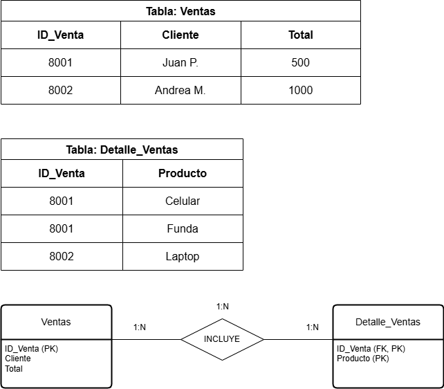
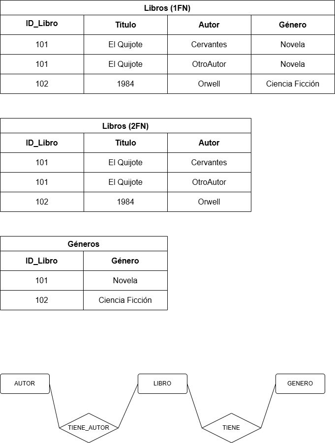
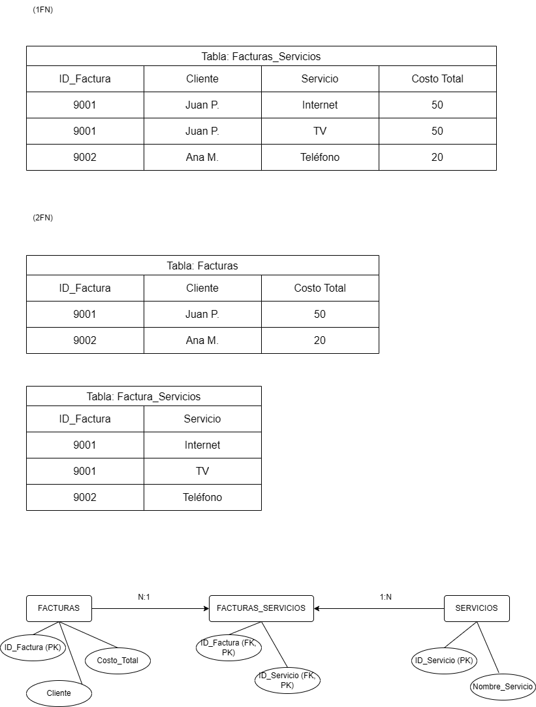
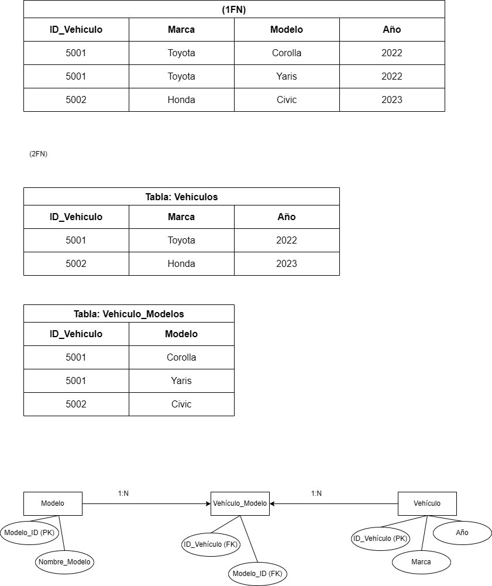
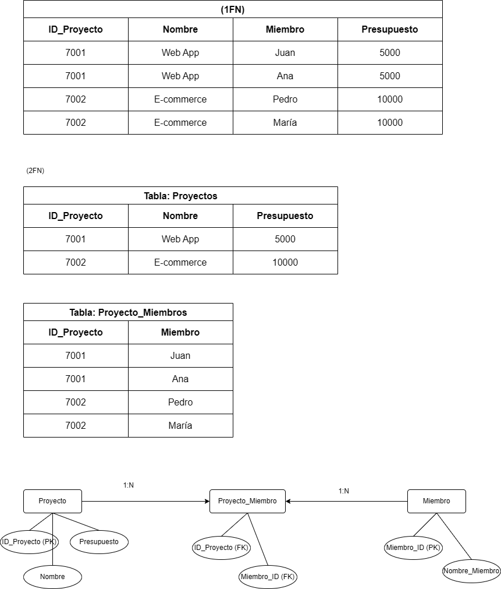

## Ejercicio 1: Lista de Productos
Tabla Inicial: Productos
ID_Producto	Nombre_Producto	Proveedores	Categoría	Precio
1	Laptop	Dell, HP	Tecnología	1000
2	Mouse	Logitech	Accesorios	25
Tareas:
Aplicar 1FN, eliminando los valores multivaluados en "Proveedores".
Aplicar 2FN, asegurando que cada campo dependa completamente de la clave primaria.
Verifica generando el modelo Entidad/Relación

## RESPUESTA

## Ejercicio 2: Pedidos de Clientes
Tabla Inicial: Pedidos
ID_Pedido	Cliente	Dirección	Producto	Cantidad	Precio
101	Juan Pérez	Calle 123	Laptop	1	1000
102	Ana López	Av. Central	Teclado	2	50
Tareas:
Aplicar 1FN, separando valores repetidos y creando nuevas tablas si es necesario.
Aplicar 2FN, asegurando que las dependencias parciales sean eliminadas.
Verifica generando el modelo Entidad/Relación

## Respuesta

## Ejercicio 3: Registro de Empleados
Tabla Inicial: Empleados
ID_Empleado	Nombre	Teléfonos	Departamento
1	Carlos R.	12345, 67890	Ventas
2	Laura M.	54321	Finanzas
Tareas:
Aplicar 1FN, eliminando los valores multivaluados en "Teléfonos".
Aplicar 2FN, asegurando que cada atributo dependa completamente de la clave primaria.

## Respuesta

## Ejercicio 4: Reservas de Hotel
Tabla Inicial: Reservas
ID_Reserva	Cliente	Habitación	Fechas	Precio
5001	Pedro G.	101	01/02, 02/02, 03/02	300
5002	María T.	202	10/03, 11/03	200
Tareas:
Aplicar 1FN, eliminando los valores multivaluados en "Fechas".
Aplicar 2FN, asegurando que las dependencias parciales sean eliminadas.

## Respuesta

## Ejercicio 5: Inscripciones a Cursos
Tabla Inicial: Inscripciones
ID_Inscripción	Estudiante	Curso	Profesor	Horarios
3001	Luis R.	Matemáticas	Prof. Pérez	Lunes 10AM, Miércoles 2PM
3002	Ana S.	Física	Prof. Gómez	Martes 3PM
Tareas:
Aplicar 1FN, eliminando valores multivaluados en "Horarios".
Aplicar 2FN, asegurando que cada campo dependa completamente de la clave primaria.

## Respuesta

## Ejercicio 6: Ventas de Tienda
Tabla Inicial: Ventas
ID_Venta	Cliente	Productos Comprados	Total
8001	Juan P.	Celular, Funda	500
8002	Andrea M.	Laptop	1000
Tareas:
Aplicar 1FN, separando valores multivaluados en "Productos Comprados".
Aplicar 2FN, asegurando que cada atributo dependa completamente de la clave primaria.

## Respuesta

## Ejercicio 7: Biblioteca de Libros
Tabla Inicial: Libros
ID_Libro	Título	Autores	Género
101	El Quijote	Cervantes	Novela
102	1984	Orwell	Ciencia Ficción
Tareas:
Aplicar 1FN, eliminando valores multivaluados en "Autores".
Aplicar 2FN, asegurando que cada atributo dependa completamente de la clave primaria.

## Respuesta

## Ejercicio 8: Facturación de Servicios
Tabla Inicial: Facturas
ID_Factura	Cliente	Servicios Contratados	Costo Total
9001	Juan P.	Internet, TV	50
9002	Ana M.	Teléfono	20
Tareas:
Aplicar 1FN, separando valores multivaluados en "Servicios Contratados".
Aplicar 2FN, asegurando que cada atributo dependa completamente de la clave primaria.

## Respuesta

## Ejercicio 9: Gestión de Vehículos
Tabla Inicial: Vehículos
ID_Vehículo	Marca	Modelos	Año
5001	Toyota	Corolla, Yaris	2022
5002	Honda	Civic	2023
Tareas:
Aplicar 1FN, eliminando valores multivaluados en "Modelos".
Aplicar 2FN, asegurando que cada atributo dependa completamente de la clave primaria.

## Respuesta

## Ejercicio 10: Gestión de Proyectos
Tabla Inicial: Proyectos
ID_Proyecto	Nombre	Miembros	Presupuesto
7001	Web App	Juan, Ana	5000
7002	E-commerce	Pedro, María	10000
Tareas:
Aplicar 1FN, eliminando valores multivaluados en "Miembros".
Aplicar 2FN, asegurando que cada atributo dependa completamente de la clave primaria.

## Respuesta

